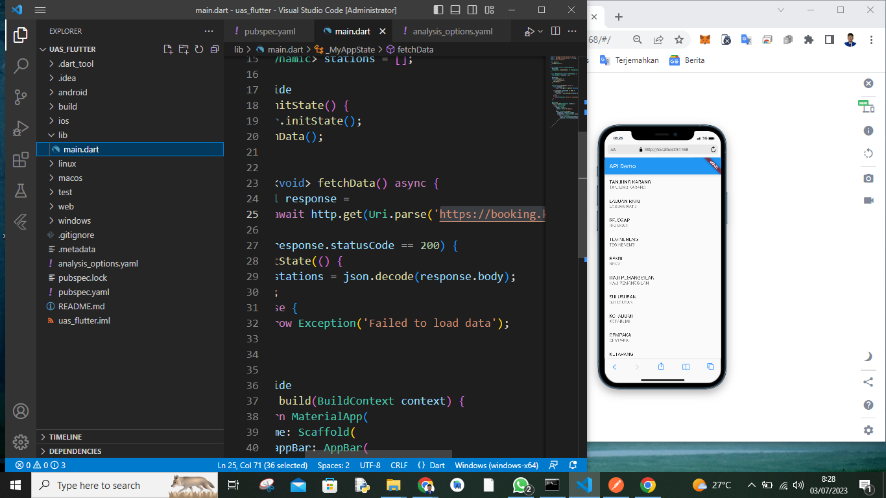

# Pemograman Web2 Pertemuan 14

## Profil
| #               | Biodata                      |
| --------------- | ---------------------------- |
| **Nama**        | M. AKMAL AL ABDILAH          |
| **NIM**         | 312110034                    |
| **Kelas**       | TI.21.A.1                    |
| **Mata Kuliah** | Pemrograman Mobile 2            |

 

## Uas Mobile2 : Memunculkan Api ListView dengan Flutter

 
 **`Link Api`**
 https://booking.kai.id/api/stations2

  

  
  Cukup Sekian Dari saya
  
  **SELESAI**
  

<h2 align="center">Thanks For Reading!!!</h2>

